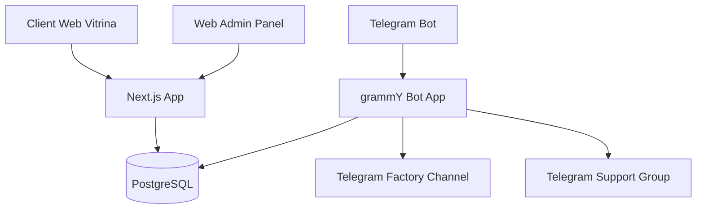
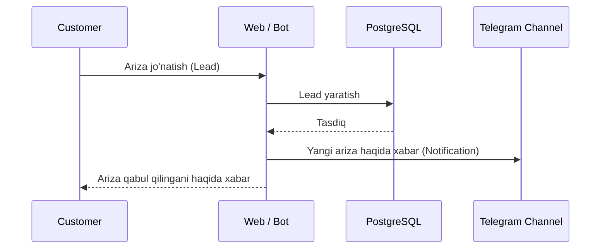
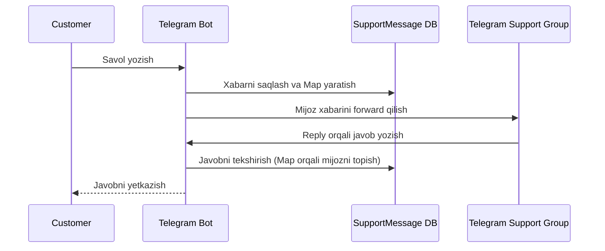
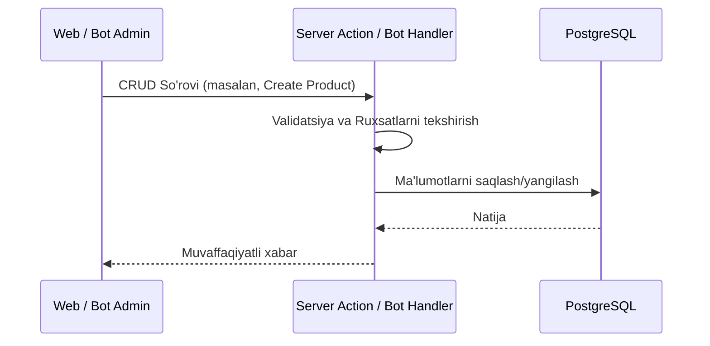

# Mebel Salon - System Architecture

Bu hujjat loyihaning umumiy arxitekturasi va asosiy komponentlari haqida ma'lumot beradi.

## 1. High-level System Overview

Tizim quyidagi asosiy qismlardan iborat:
- **Client Web (Vitrina):** Xaridorlar uchun Next.js da yozilgan frontend.
- **Web Admin Panel:** Ma'murlar uchun boshqaruv paneli.
- **Telegram Bot:** Xaridorlar va adminlar uchun Telegram interfeysi (grammY).
- **PostgreSQL Database:** Asosiy ma'lumotlar bazasi (Prisma ORM orqali).
- **Telegram Channels & Groups:** Bildirishnomalar va qo'llab-quvvatlash uchun.



## 2. Component Breakdown

### 2.1 Web Vitrina (Next.js Frontend)
- **Framework:** Next.js 14+ (App Router).
- **Styling:** Tailwind CSS va shadcn/ui.
- **Features:** Katalog, "Mening tanlovlarim" (wishlist/leads basket), checklist, dark/light rejim (next-themes), 3 ta til (next-intl).

### 2.2 Web Admin Panel
- **Security:** Protected routes orqali himoyalangan.
- **Features:** Desktop CRUD operatsiyalari, kelib tushgan arizalar (leads) jadvali.

### 2.3 API Layer
- **Implementation:** Server Actions va Next.js API Routes.
- **Purpose:** Frontend va ma'lumotlar bazasi o'rtasida ishonchli va xavfsiz aloqa.

### 2.4 Telegram Bot (grammY)
- **Framework:** grammY (TypeScript).
- **Customer Role:** Katalog ko'rish, deep link orqali ariza (lead) qoldirish, jonli muloqot (live chat).
- **Admin Role:** Mobile CRUD operatsiyalar (FSM - Finite State Machine orqali).

### 2.5 Database (PostgreSQL + Prisma)
- **DBMS:** PostgreSQL.
- **ORM:** Prisma, qat'iy tiplashtirilgan bazani ta'minlaydi.

### 2.6 Media Storage
- **Storage:** Supabase Storage yoxud Cloudinary.
- **Usage:** Mahsulotlar va kolleksiyalar rasmlarini saqlash uchun.

## 3. Data Flow Diagrams

### 3.1 Lead (Application) Flow
Xaridor Web Vitrina yoki Telegram Bot orqali ariza qoldirganda quyidagi jarayon yuz beradi:



### 3.2 Live Chat Flow
Mijoz qo'llab-quvvatlash xizmati bilan bot orqali gaplashishi:



### 3.3 Admin CRUD Flow


## 4. Authentication Architecture
- **Web Admin:** JWT (JSON Web Token) `jose` kutubxonasi orqali amalga oshiriladi. Login vaqtida JWT token yaratilib, httpOnly cookie'ga saqlanadi. Har bir admin API so'rovida middleware ushbu tokenni tekshiradi.
- **Bot Admin:** `ADMIN_TELEGRAM_IDS` muhit o'zgaruvchisidagi Telegram User ID ro'yxati orqali tekshiriladi. Har bir admin buyrug'ida foydalanuvchi ID si ushbu ro'yxatda mavjudligi tekshiriladi.

## 5. i18n Architecture
- **Texnologiya:** `next-intl`
- **Tillar:** UZ (asosiy), RU, EN.
- **Routing:** Path-based i18n (masalan, `/uz/products`, `/ru/products`).
- Barcha matnlar tegishli til fayllarida (`messages/uz.json` va hk) saqlanadi. Tizim avtomatik ravishda foydalanuvchi tilini aniqlaydi yoki u o'zgartirganda saqlab qoladi.

## 6. Folder Structure

Loyiha monorepo tuzilmasidan foydalanadi:

```text
📦 mebel-salon/
 ┣ 📂 apps/
 ┃ ┣ 📂 web/              # Next.js App Router (Vitrina + Admin Panel)
 ┃ ┃ ┣ 📂 app/            # App Router sahifalar va API route’lar
 ┃ ┃ ┃ ┣ 📂 [locale]/     # i18n: uz/ru/en path-based routing
 ┃ ┃ ┃ ┣ 📂 api/          # API Route Handlers
 ┃ ┃ ┃ ┗ 📂 admin/        # Admin Panel (protected)
 ┃ ┃ ┣ 📂 components/     # Qayta ishlatiluvchi UI komponentlar
 ┃ ┃ ┣ 📂 hooks/          # Custom React hook’lar
 ┃ ┃ ┣ 📂 lib/            # Utilitalar (Prisma client, auth, utils)
 ┃ ┃ ┗ 📂 types/          # TypeScript tiplari
 ┃ ┗ 📂 bot/              # grammУ Telegram Bot
 ┃   ┣ 📂 handlers/       # Command va message handler’lar
 ┃   ┣ 📂 conversations/  # FSM dialoglar (@grammyjs/conversations)
 ┃   ┗ 📜 bot.ts          # Bot entry point
 ┣ 📂 packages/
 ┃ ┣ 📂 db/               # Prisma schema, migratsiyalar, seed
 ┃ ┗ 📂 shared/           # Umumiy tiplar, zod schemalar, utillar
 ┣ 📂 messages/           # i18n tarjima fayllari (uz.json, ru.json, en.json)
 ┣ 📂 public/             # Statik fayllar
 ┣ 📂 docs/               # Hujjatlar
 ┗ 📂 docker/             # Dockerfile’lar va docker-compose
```

> **Muhim:** `packages/shared/` papkasida `Product`, `Lead`, `Category` kabi Prisma generated type’lar va zod validation schema’lari saqlanadi. Bu bot va web o‘rtasida tip sinxronizatsiyasini ta’minlaydi.

## 7. Scalability Considerations
- Next.js Vercel'da yengil scale qilinishi mumkin.
- Bot uchun Docker yordamida VPS'da alohida instance ishga tushiriladi va zarur bo'lsa Webhooks arxitekturasiga o'tilishi mumkin (hozirda polling orqali ham ishlashi mumkin).
- DB ulanishlarni boshqarish uchun Prisma orqali connection pooling qilinishi maqsadga muvofiq.

## 7.5 Type Safety
Bot va Web bir xil Prisma generated type’lardan va zod schema’lardan foydalanadi (`packages/shared/`). Bu type drift xavfini bartaraf etadi.
