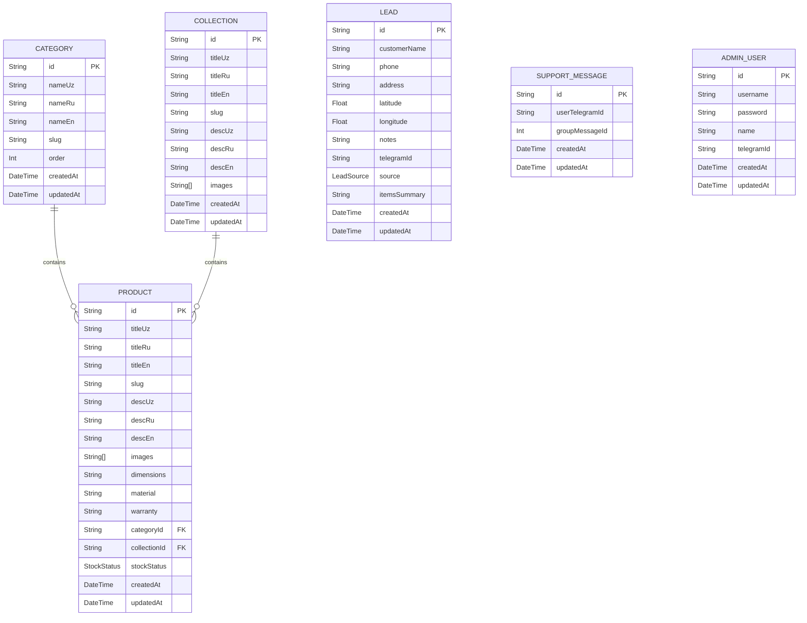

# Mebel Salon - Database Documentation

Bu hujjat ma'lumotlar bazasi tuzilishi, modellar va ularning aloqalarini tavsiflaydi. Loyiha PostgreSQL va Prisma ORM dan foydalanadi.

## 1. ER Diagram



## 2. Detailed Model Descriptions

### 2.1 Category
Mahsulot toifalari (Masalan: Yumshoq mebellar, Oshxona mebellari).
- `id`: String (UUID), Primary Key.
- `nameUz`, `nameRu`, `nameEn`: String, ko'p tilli toifa nomlari.
- `slug`: String, URL uchun noyob (unique) indeks.
- `order`: Int, tartib raqami.
- `createdAt` / `updatedAt`: Avtomatik vaqt belgilari.

### 2.2 Collection
Mebellar to'plami (Masalan: "Toshkent" kolleksiyasi).
- `id`: String (UUID), Primary Key.
- `titleUz`, `titleRu`, `titleEn`: String, ko'p tilli sarlavhalar.
- `slug`: String, Unique.
- `descUz`, `descRu`, `descEn`: String, kolleksiya haqida batafsil ma'lumot.
- `images`: String[], kolleksiya uchun rasm URL'lari ro'yxati.
- `createdAt` / `updatedAt`: Avtomatik vaqt belgilari.

### 2.3 Product
Katalogdagi aniq bir mebel mahsuloti.
- `id`: String (UUID), Primary Key.
- `titleUz`, `titleRu`, `titleEn`: String, asosiy sarlavhalar.
- `slug`: String, Unique, URL uchun.
- `descUz`, `descRu`, `descEn`: String, batafsil tavsiflar.
- `dimensions`: String (Optional), mahsulot o'lchamlari.
- `material`: String (Optional), mahsulot materiali.
- `warranty`: String (Optional), kafolat ma'lumoti.
- `images`: String[], mahsulotning rasmlari ro'yxati.
- `categoryId`: String (UUID), `Category` jadvaliga Foreign Key.
- `collectionId`: String (UUID, Optional), `Collection` jadvaliga Foreign Key.
- `stockStatus`: `StockStatus` Enum.
- `createdAt` / `updatedAt`: Avtomatik vaqt belgilari.

### 2.4 Lead
Mijozlardan kelib tushgan arizalar. Loyihada savdo/to'lov yo'q, shuning uchun "Order" o'rniga "Lead" ishlatiladi.
- `id`: String (UUID), Primary Key.
- `customerName`: String, Mijoz ismi.
- `phone`: String, Mijoz telefon raqami.
- `address`: String (Optional), manzil.
- `latitude`, `longitude`: Float (Optional), geolokatsiya koordinatalari.
- `notes`: String (Optional), qo'shimcha izohlar.
- `telegramId`: String (Optional), Agar ariza bot orqali yuborilgan bo'lsa.
- `source`: `LeadSource` Enum (WEB yoki BOT).
- `itemsSummary`: String, mijozning tanlagan mahsulotlarining qisqacha xulosasi.
- `createdAt` / `updatedAt`: Avtomatik vaqt belgilari.

### 2.5 SupportMessage
Telegramdagi Live Chat tizimini ishlashi uchun zarur bo'lgan xaritalash (mapping) jadvali.
- `id`: String (UUID), Primary Key.
- `userTelegramId`: String, Mijozning Telegram ID'si.
- `groupMessageId`: Int (Unique), Support guruhidagi forward qilingan xabarning ID'si. Bot guruhdagi reply'ni ushbu ID orqali mijozning o'ziga jo'natadi.
- `createdAt` / `updatedAt`: Avtomatik vaqt belgilari.

### 2.6 AdminUser
Web va Bot orqali tizimni boshqaruvchi ma'murlar.
- `id`: String (UUID), Primary Key.
- `username`: String (Unique), tizimga kirish uchun login.
- `password`: String, hashlangan parol (bcrypt yordamida >= 10 rounds).
- `name`: String, adminning to'liq ismi.
- `telegramId`: String (Optional), Bot orqali admin paneldan foydalanish uchun telegram ID biriktiriladi.
- `createdAt` / `updatedAt`: Avtomatik vaqt belgilari.

## 3. Enums

### 3.1 StockStatus
Mahsulotning ombordagi holati:
- `IN_STOCK`: Omborda mavjud.
- `MADE_TO_ORDER`: Buyurtma asosida tayyorlanadi.

### 3.2 LeadSource (Recommendation)
Arizaning qayerdan kelib tushganligini bildiradi:
- `WEB`: Veb-sayt orqali yuborilgan ariza.
- `BOT`: Telegram bot orqali yuborilgan ariza.

## 4. Common Queries Examples (Prisma Syntax)

**Yangi mahsulot qo'shish:**
```typescript
const newProduct = await prisma.product.create({
  data: {
    titleUz: 'Divan',
    titleRu: 'Диван',
    titleEn: 'Sofa',
    slug: 'divan-premium',
    categoryId: 'uuid-category-1',
    stockStatus: 'IN_STOCK',
    images: ['url1.jpg', 'url2.jpg'],
    descUz: 'Zo\'r divan',
    descRu: 'Отличный диван',
    descEn: 'Great sofa'
  }
});
```

**Barcha arizalarni (Leads) oxirgisidan boshlab olish:**
```typescript
const leads = await prisma.lead.findMany({
  orderBy: { createdAt: 'desc' }
});
```

## 5. Migration Guide
Prisma sxemasiga o'zgartirish kiritilgandan so'ng, ma'lumotlar bazasini yangilash uchun quyidagi komanda ishlatiladi:
```bash
npx prisma migrate dev --name <migration_nomi>
```
Bu baza strukturasini yangilaydi va TypeScript turlarini ham yangilaydi.

## 6. Seed Data Instructions
Tizimni dastlabki ma'lumotlar (toifalar, admin foydalanuvchi) bilan to'ldirish uchun `prisma/seed.ts` faylidan foydalaning.
Ishga tushirish:
```bash
npx prisma db seed
```

## 7. Database Backup and Restore
Baza zaxirasini olish (pg_dump yordamida):
```bash
pg_dump -U username -h localhost -d db_name > backup.sql
```
Zaxirani tiklash (psql yordamida):
```bash
psql -U username -h localhost -d db_name < backup.sql
```
