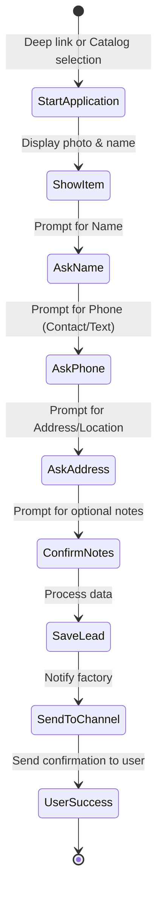
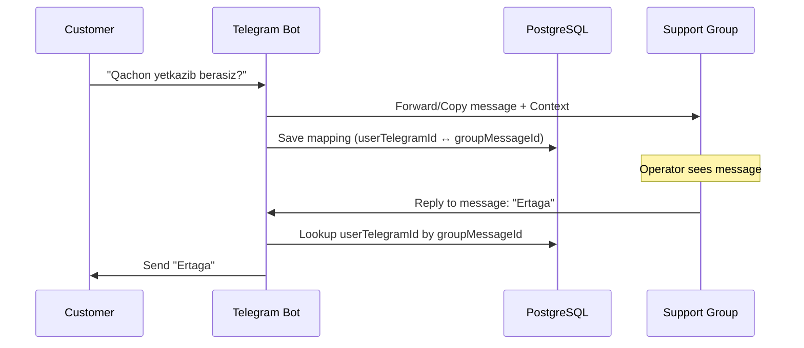

# Telegram Bot Documentation

## Bot Overview
The Telegram Bot is a crucial part of the Mebel Salon MVP, serving as a primary interaction channel for both customers and administrators.

**Capabilities:**
- **Customer:** Browse catalog (categories, collections, products), submit applications (leads) for specific furniture, and chat with support.
- **Admin:** Manage catalog (CRUD for categories, collections, products) directly from Telegram, bypassing the web admin panel if needed.
- **System:** Route customer applications to a designated factory channel and handle live support routing via a dedicated support group.

**Bot Username:** `@PlaceholderBot` *(replace with actual bot username after deployment)*

## Customer Commands
- `/start` — Welcome message and main menu (inline keyboard).
- `/catalog` — Browse categories and products.
- `/collections` — Browse furniture collections.
- `/help` — Instructions on how to use the bot.

**Deep Linking:**
Customers can directly apply for specific items using deep links (usually generated on the vitrina web app):
- Product deep link: `t.me/<BOT>?start=order_product_<ID>`
- Collection deep link: `t.me/<BOT>?start=order_set_<ID>`

**Deep Link Validation:**
Conversation boshida deep link parametridagi ID bazada mavjudligi tekshiriladi:
- `prisma.product.findUnique({ where: { id } })` yoki `prisma.collection.findUnique({ where: { id } })`
- Topilmasa: foydalanuvchiga "Bu mahsulot topilmadi yoki o'chirilgan" xabari yuboriladi va conversation to'xtatiladi.
- ID formati UUID ekanligini tekshirish (regex yoki zod bilan).

## Application Flow (4 Steps FSM)
The process of placing an application (Lead) is handled via a Finite State Machine (FSM).



**Detailed Steps:**
1. **Show Item:** Displays the requested product/collection photo and name.
2. **Ask Name:** Expects text input for the customer's full name.
3. **Ask Phone Number:** Customer can send their contact via a "Share Contact" keyboard button or type it out.
4. **Ask Address:** Customer can send geolocation or type the delivery address. Optional notes can be added here.
→ *Result:* Saves Lead to PostgreSQL + Prisma, sends formatted notification to the factory channel, and sends a "Thank You" confirmation to the user.

## Inline Catalog
Customers can browse items interactively without leaving the chat.
- **Categories:** Selected via inline keyboards.
- **Product Cards:** Display product photo, name, parameters (stock status, materials). Includes an "Ariza qoldirish" (Apply) button.
- **Navigation:** Inline buttons for "Back", "Next Page", and "Previous Page".

## Live Chat System
The bot acts as a bridge between customers and support staff.

- **Customer to Support:** Any standard message (not in an active FSM state and not a command) sent by a customer is forwarded to the Support Group.
- **Support Group:** Operators see the message with context (who sent it).
- **Reply Mechanism:** Operators simply use Telegram's "Reply" feature on the forwarded message. The bot reads the reply and sends it back to the specific customer.
- **Mapping:** The database model `SupportMessage` maps `groupMessageId` to `userTelegramId`.



**Operatsiya ketma-ketligi (muhim):**
1. Avval xabarni Support guruhiga forward/copy qilish va `message_id` ni olish.
2. Keyin `SupportMessage` jadvaliga `groupMessageId ↔ userTelegramId` mapping saqlash.
3. Forward muvaffaqiyatsiz bo'lsa — DB ga yozmaslik.
4. DB yozish muvaffaqiyatsiz bo'lsa — foydalanuvchiga "Qayta urinib ko'ring" xabari.

## Admin Bot Commands
Admin features are restricted to users listed in `ADMIN_TELEGRAM_IDS` (env variable, masalan: `ADMIN_TELEGRAM_IDS=123,456`).

- `/admin` — Opens the main admin menu.

### Admin FSM Flows
Admin actions use conversational FSMs for step-by-step data entry.

**Category CRUD:**
- Name (UZ, RU, EN), Description (optional).

**Collection CRUD:**
- Name, Description, attach Categories, upload Photo.

**Product CRUD Flow (7 Steps):**
1. Select Category & Collection.
2. Enter Name (UZ, RU, EN).
3. Enter Description.
4. Upload Photo(s).
5. Set Stock Status (`IN_STOCK` / `MADE_TO_ORDER`).
6. Set Parameters (Dimensions, Materials).
7. Confirm & Save.

*Search functionality is available to find products by name or ID to edit/delete.*

**Concurrent Edit Warning:**
Bir nechta admin bir vaqtning o'zida bitta mahsulotni tahrirlasa, oxirgi yozuvchi g'olib chiqadi (last-write-wins). Buning oldini olish uchun `updatedAt` maydoni orqali optimistic locking tavsiya etiladi.

## Channel Notification Format
When a lead is created, a notification is sent to the Factory Channel.

**Message Template:**
```text
🔔 **Yangi Ariza!** (New Lead)

👤 Mijoz: [Name]
📞 Telefon: [Phone]
📍 Manzil: [Address]
📝 Izoh: [Notes]

🪑 Mahsulot: [Product/Collection Name]
📦 Holati: [Stock Status]

🆔 Ariza raqami: #[LeadID]
```

## Technical Details
- **Framework:** [grammY](https://grammy.dev/) for robust Telegram Bot API integration.
- **FSM / State Management:** `@grammyjs/conversations` for managing multi-step workflows like applications and admin CRUD.
- **Session Storage:** Session storage Prisma adapter orqali PostgreSQL da saqlanadi (`@grammyjs/storage-prisma`). Bu bot qayta ishga tushganda ham conversation state'lar saqlanib qolishini ta'minlaydi.
- **Deployment Strategy:** 
  - *Webhook:* Can be deployed on Vercel along with the Next.js app (serverless).
  - *Long Polling:* Recommended for VPS Docker deployment to avoid webhook timeout limits and ensure background processes run smoothly.
- **Error Handling:** Centralized error boundaries, graceful fallbacks for missing media, and user-friendly error messages (e.g., "Kechirasiz, xatolik yuz berdi").

## Webhook Security
- `setWebhook` chaqiruvi vaqtida `secret_token` parametri o'rnatilishi SHART.
- Webhook handler har bir so'rovda `X-Telegram-Bot-Api-Secret-Token` headerini `TELEGRAM_WEBHOOK_SECRET` env variable bilan solishtirishi kerak.
- grammY da `webhookCallback(bot, { secretToken: process.env.TELEGRAM_WEBHOOK_SECRET })` ishlatiladi.
- Secret token mos kelmasa, `401 Unauthorized` qaytariladi.
